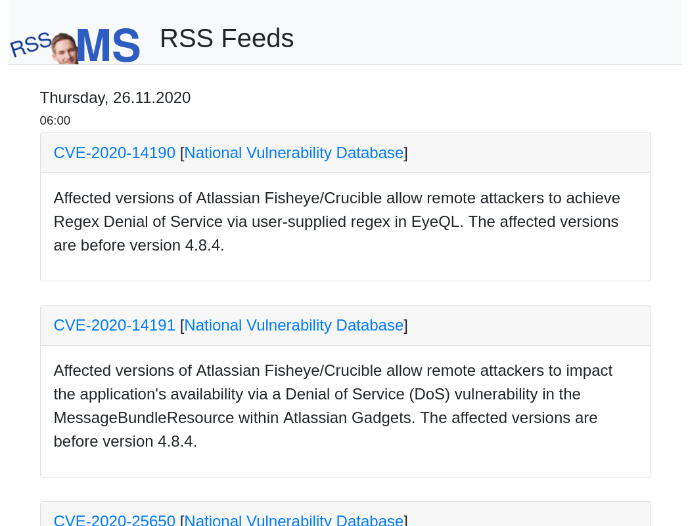

# About
This repository contains template files for the [rawdog RSS reader](https://offog.org/code/rawdog/). If these are used, the generated HTML output will use [bootstrap](https://getbootstrap.com/). If you want rawdog to use other templates than the default one, you will have to change the settings of `itemtemplate`, `pagetemplate`, `feedlisttemplate` and `feeditemtemplate` in your configuration file. You should also change the links to bootstrap in the page template to match your local setup. 

# Screenshot

